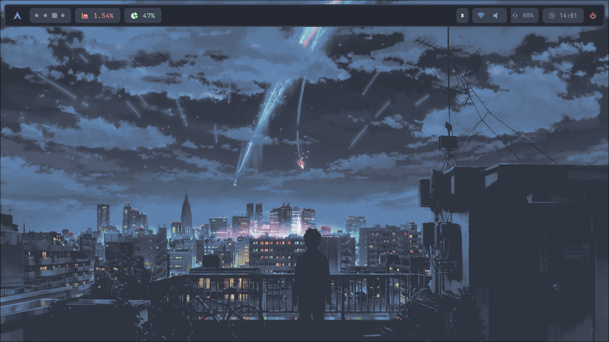
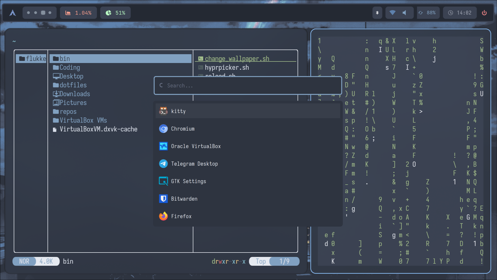
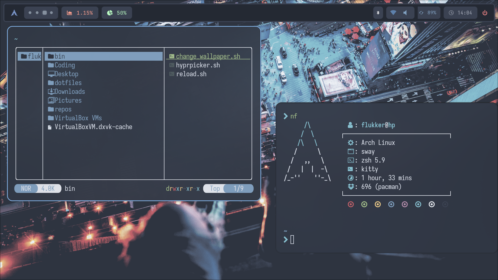

# Flukker's Dots
Hyprland Dotfiles

## 📦 Programs

List of programs and tools I use.

| Component         | Program    |
|-------------------|------------|
| Windows Manager 🪟| [hyprland](https://github.com/hyprwm/Hyprland)  |
| Color Picker ✒️   | [hyprpicker](https://github.com/hyprwm/hyprpicker) |
| Fetch 🏵️          | [neofetch](https://github.com/dylanaraps/neofetch) |
| Background 🌫️     | [swww](https://github.com/LGFae/swww) / [swayimg](https://github.com/artemsen/swayimg)
| Terminal 🖥️       | [kitty](https://github.com/kovidgoyal/kitty)        |
| Shell 🐚          | [zsh](https://github.com/ohmyzsh/ohmyzsh/wiki/Installing-ZSH)   |
| Prompt 🀄         | [starship](https://starsip.rs)
| File Manager 📁   | [yazi](https://github.com/sxyazi/yazi)   / [thunar](https://github.com/mtwebster/thunar)      |
| Editor 📝         | [neovim](https://github.com/neovim/neovim) / [nvchad](https://github.com/NvChad/NvChad)     |
| Browser 🌐        | [zen browser](https://zen-browser.app/)     |
| Bar 📊            | [waybar](https://github.com/Alexays/Waybar)      |
| Launcher 🚀       | [rofi](https://github.com/davatorium/rofi)          |
| Lockscreen 🔒     | [hyprlock](https://github.com/hyprwm/hyprlock)  |
| Login Menu 🚪     | [sddm](https://github.com/sddm/sddm)          |

## 🎸 Preview

## 📝 Credits

- **Idea** https://github.com/Spelljinxer
